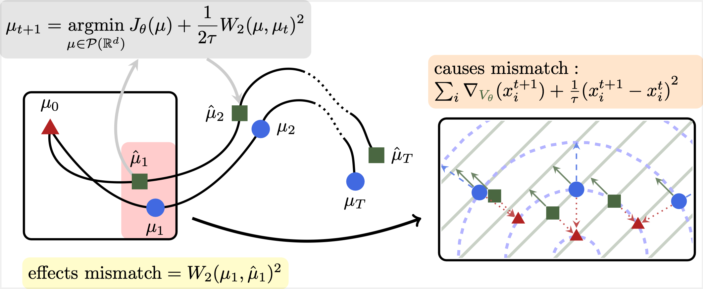
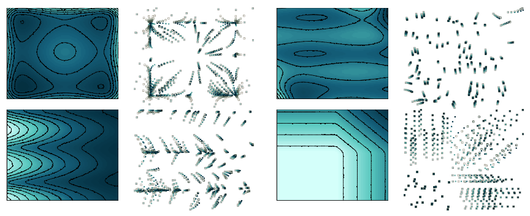

# Learning Diffusion at Lightspeed
<h3><a href="">Paper</a> | <a href="https://www.antonioterpin.com/projects/learning-diffusion-lightspeed">Project page and documentation</a> </h3>

**Authors:** Antonio Terpin, Nicolas Lanzetti, Martin Gadea, Florian Dörfler

This repo contains a JAX implementation of the JKOnet* architecture presented in "Learning Diffusion at Lightspeed". Please check out the <a href="https://www.antonioterpin.com/projects/learning-diffusion-lightspeed">project page and documentation</a> for all the information.


## Abstract 🤓
<p align='center'> </p>


# Installation guide
- [Docker](#docker)
- [MacOS](#macos)
- [Ubuntu](#ubuntu)
- [Windows](#windows)

**Note**: The installation instructions provided here are not GPU friendly. If you have a GPU, install the necessary packages for GPU support. Running the experiments on a GPU can yield significant speedups, especially for the JKOnet* full model (`jkonet-star`). We collected the training times on a RTX 4090.

## Docker

Docker needs to be installed on your machine before proceeding. You can download Docker from the official site: https://www.docker.com/.

Once Docker is installed and running, follow these steps to build the Docker image. Execute the following command from the root directory of the repository:

```bash
docker build -t jkonet-star-app .
```

If you encounter any issues with the Docker build, ensure that Docker is running and that you have the necessary permissions to execute Docker commands. You can also try to pull the `python:3.12-slim` image before building the `jkonet-star-app` image:

```bash
docker pull python:3.12-slim
```

### Running JKOnet* using Docker

After building the image, you can generate data and train models by executing the following commands:

```bash
# Generate population data
docker run -v .:/app jkonet-star-app python data_generator.py --potential wavy_plateau

# Train the model on the generated dataset
docker run -v .:/app jkonet-star-app python train.py --solver jkonet-star-potential --dataset potential_wavy_plateau_internal_none_beta_0.0_interaction_none_dt_0.01_T_5_dim_2_N_2000_gmm_10_seed_0_split_0.5_split_trajectories_True_lo_-1_sinkhorn_0.0
```

## MacOS

These steps have been tested on MacOS 13.2.1 and should also work on Ubuntu systems.

### Steps:

1. **Install Miniconda**

   Download and install Miniconda from the official website: https://docs.conda.io/en/latest/miniconda.html.

2. **Create a Conda environment**

   Open a terminal and run the following commands to create and activate a new Conda environment:

```bash
   conda create --name jkonet-star python=3.12
   conda activate jkonet-star
```

3. **Install the required packages**

   Once the environment is activated, install the necessary dependencies:

```bash
   pip install -r requirements.txt
```
   To install `parallel` (used for running the benchmarks), you can use the following command on MacOS:

```bash
   brew install parallel
```

4. **Test the installation**

   You can generate data and train models by executing the following commands:

```bash
   # Generate population data
   python data_generator.py --potential wavy_plateau

   # Train the model on the generated dataset
   python train.py --solver jkonet-star-potential --dataset potential_wavy_plateau_internal_none_beta_0.0_interaction_none_dt_0.01_T_5_dim_2_N_2000_gmm_10_seed_0_split_0.5_split_trajectories_True_lo_-1_sinkhorn_0.0
```

## Ubuntu

These steps have been tested on Ubuntu systems.

### Steps:

1. **Install Miniconda**

   Download and install Miniconda from the official website: https://docs.conda.io/en/latest/miniconda.html.

2. **Create a Conda environment**

   Open a terminal and run the following commands to create and activate a new Conda environment:

```bash
   conda create --name jkonet-star python=3.12
   conda activate jkonet-star
```

3. **Install the required packages**

   Once the environment is activated, install the necessary dependencies:

```bash
   pip install -r requirements.txt
```
   To install `parallel` (used for running the benchmarks), you can use the following command on Ubuntu:

```bash
   sudo apt-get install parallel
```

4. **Test the installation**

   You can generate data and train models by executing the following commands:

```bash
   # Generate population data
   python data_generator.py --potential wavy_plateau

   # Train the model on the generated dataset
   python train.py --solver jkonet-star-potential --dataset potential_wavy_plateau_internal_none_beta_0.0_interaction_none_dt_0.01_T_5_dim_2_N_2000_gmm_10_seed_0_split_0.5_split_trajectories_True_lo_-1_sinkhorn_0.0
```

## Windows

The following instructions are for Windows 11 users. Please note that Python 3.9 is required for compatibility.

### Steps:

1. **Install Miniconda**

   Download and install Miniconda from the official website: https://docs.conda.io/en/latest/miniconda.html.

2. **Create a Conda environment**

   Run the following commands in your terminal to create and activate the environment with Python 3.9:

```bash
   conda create --name jkonet-star python=3.9
   conda activate jkonet-star
```

3. **Install the required packages**

   Once the environment is activated, install the necessary dependencies for Windows:

```bash
   pip install -r requirements-win.txt
```

4. **Test the installation**

   You can generate data and train models by executing the following commands:

```bash
   # Generate population data
   python data_generator.py --potential wavy_plateau

   # Train the model on the generated dataset
   python train.py --solver jkonet-star-potential --dataset potential_wavy_plateau_internal_none_beta_0.0_interaction_none_dt_0.01_T_5_dim_2_N_2000_gmm_10_seed_0_split_0.5_split_trajectories_True_lo_-1_sinkhorn_0.0
```

---
