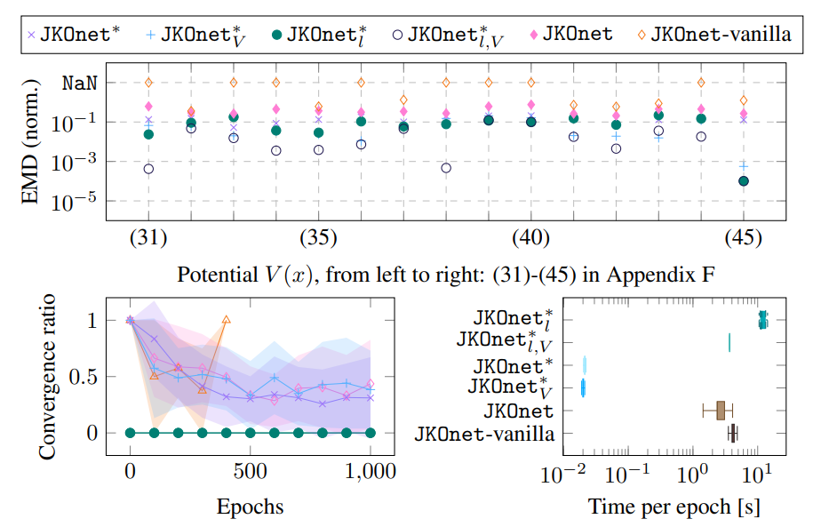
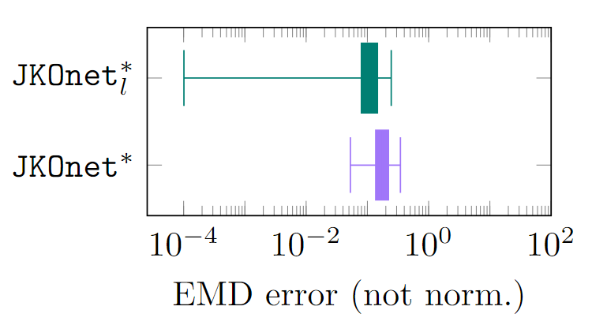

Benchmarks 🔥
====================

In this page we report the benchmarks for the JKOnet\* model on the synthetic data. For the results related to the single-cell data, please refer to the :doc:`tutorial_rna` page. Check also the `paper <https://arxiv.org/abs/2406.12616>`_ for more details.

Our Models
~~~~~~~~~~~

We use the following terminology for our methods. JKOnet\ :sup:`*` is the most general non-linear parametrization and JKOnet\ :sup:`*`\ :sub:`V` introduces the inductive bias :math:`\theta_2 = \theta_3 = 0`. Similarly, we refer to the linear parametrizations as JKOnet\ :sup:`*`\ :sub:`l,V` and JKOnet\ :sup:`*`\ :sub:`l`.

Metrics
~~~~~~~

To evaluate the prediction capabilities, we use the one-step-ahead earth-mover distance (EMD), defined as

.. math::

   \min_{\gamma \in \Gamma(\mu_t, \hat{\mu}_t)} \int_{\mathbb{R}^{d} \times \mathbb{R}^{d}} \|x - y\| \, d\gamma(x, y),

where :math:`\mu_t` and :math:`\hat{\mu}_t` are the observed and predicted populations, respectively. In particular, we consider the average and standard deviation over a trajectory.

Experiment 4.1: Training at lightspeed
~~~~~~~~~~~~~~~~~~~~~~~~~~~~~~~~~~~~~~

**Experimental Setting**
------------------------
We compare (i) the EMD error, (ii) the convergence ratio, and (iii) the time per epoch required by the different methods on a synthetic dataset consisting of particles subject to a non-linear drift, :math:`x_{t+1} = x_t - \tau \nabla V(x_t)`, where :math:`\tau = 0.01`, :math:`T = 5`, and the potential functions :math:`V(x)` in :mod:`utils.functions`.

**Results**
------------------------
The figure below, which is composed of three plots, collects all the numerical results of the experiment. The scatter plot displays points :math:`(x_i, y_i)`, where :math:`x_i` indexes the potentials in :mod:`utils.functions` and :math:`y_i` represents the errors (EMD, normalized such that the maximum error among all models and all potentials is 1) obtained with the different models. Each method that diverged during training is marked with NaN. The plot in the bottom-left shows the EMD error trajectory during training, normalized such that 0 and 1 represent the minimum and maximum EMD, respectively, and averaged over all experiments. The shaded area indicates the standard deviation. Additionally, the box plot analyzes the time per epoch required by each method, with statistics compiled across all epochs and all potential energies.

All our methods perform uniformly better than the baseline, regardless of the generality. The speed improvement of the JKOnet\∗ models family suggests that a theoretically guided loss may provide strong computational benefits on par with sophisticated model architectures. Our linearly parameterized models, JKOnet\ :sup:`*`\ :sub:`l` and JKOnet\ :sup:`*`\ :sub:`l,V`, require a computational time per epoch comparable to the JKOnet family, but they only need one epoch to solve the problem optimally. Our non-linear models, JKOnet\ :sup:`*`\ and JKOnet\ :sup:`*`\ :sub:`V`, instead both require significantly lower time per epoch and converge faster than the JKOnet family. Compared to JKOnet, our model also requires a simpler architecture: we drop the additional ICNN used in the inner iteration and the related training details. Notice that simply replacing the ICNN in JKOnet with a vanilla MLP deprives the method of the theoretical connections with optimal transport, which, in our experiments, appears to be associated with stability (NaN in the topmost plot).

**Running the experiment**
--------------------------
To perform the experiment run the following script. Since the script relies on ``parallel`` you need to make sure it is installed, otherwise refer to the :doc:`installation` page.

.. code-block:: bash

    bash -r scripts/exp1.sh

**Post-processing**
--------------------
To retrieve the results from wandb and write them into a file, run the following command:

.. code-block:: bash

    python scripts/exp1_plot.py

You're on your own when it comes to generating the plots. 😊

Experiment 4.2:  Scaling laws
~~~~~~~~~~~~~~~~~~~~~~~~~~~~~~

**Experimental Setting**
------------------------

We evaluate the performance of JKOnet\ :sup:`*`\ :sub:`V` to recover the correct potential energy given :math:`N \in \{1000, 2500, 5000, 7500, 10000\}` across dimensions :math:`d \in \{10, 20, 30, 40, 50\}`.

**Results**
------------------------
Below we display the EMD error obtained for every configuration. The stable color along the rows suggests an almost constant error (the EMD error is related to the Euclidean norm and, thus, is expected to grow linearly with the dimension :math:`d`; here, the growth is strongly sublinear) up to the point where the number of particles is not informative enough (along the columns, the error decreases again). The time complexity of the computation of the optimal transport plans is influenced linearly by the dimensionality d, and is negligible compared to the solution of the linear program, which depends only on the number of particles, check the `paper <https://arxiv.org/abs/2406.12616>`_ for more details. We thus conclude that JKOnet\∗ is well suited for high-dimensional tasks.

.. image:: ../_static/exp_2.png
   :alt: Scaling laws

**Running the experiment**
--------------------------
To perform the experiment run the following script. Since the script relies on ``parallel`` you need to make sure it is installed, otherwise refer to the :doc:`installation` page.

.. code-block:: bash

    bash -r scripts/exp2.sh

  
**Post-processing**
--------------------
To retrieve the results from wandb and write them into a file, run the following command:

.. code-block:: bash

    python scripts/exp2_plot.py

You're on your own when it comes to generating the plots. 😊

Experiment 4.3:  General energy functionals
~~~~~~~~~~~~~~~~~~~~~~~~~~~~~~~~~~~~~~~~~~~

**Experimental Setting**
------------------------
We showcase the capabilities of the JKOnet\∗ models to recover the potential, interaction, and internal energies selected as combinations of the functions in :mod:`utils.functions` and noise levels :math:`\beta \in \{0.0, 0.1, 0.2\}`. To our knowledge, this is the first model to recover all three energy terms.

**Results**
-------------
Below are collected the numerical results of the experiment. Compared to the setting in Experiment 4.1, there are two additional sources of inaccuracies: (i) the noise, which introduces an inevitable sampling error, and the (ii) the estimation of the densities (check the `paper <https://arxiv.org/abs/2406.12616>`__ for more details). Nonetheless, the low EMD errors demonstrate the capability of JKOnet\∗ to recover the energy components that best explain the observed populations.

**Running the experiment**
--------------------------
To perform the experiment run the following script. Since the script relies on ``parallel`` you need to make sure it is installed, otherwise refer to the :doc:`installation` page.

.. code-block:: bash

    bash -r scripts/exp3.sh

**Post-processing**
--------------------
To retrieve the results from wandb and write them into a file, run the following command:

.. code-block:: bash

    python scripts/exp3_plot.py

You're on your own when it comes to generating the plots. 😊

TODO note we did not test the bash scripts in Docker yet, but you can reproduce the results by running the commands in the terminal.
