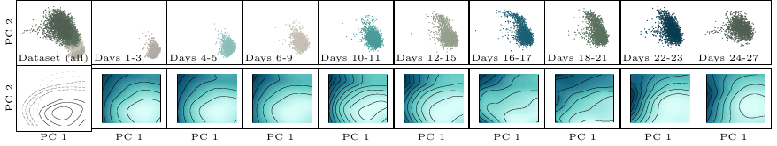

Results
============
Initial calculations and observations of the dataset suggested that the energy governing cell evolution might
be time-varying. This hypothesis was further validated when we noticed that other research
:cite:`tong2020trajectorynet` and :cite:`tong2023improving` also incorporated time as a parameter
in their methodologies, reinforcing the notion that a time-dependent model could be crucial for accurately
capturing the dynamics of cell evolution.

To further validate our time-varying hypothesis we display the time evolution of the first two principal
components of the level curves of the potential energy minimized by the cells,
along with the cells trajectory (in green the data, in blue the interpolated predictions).

To evaluate quantitatively the quality of our results, we train our models on :math:`60\%` of the data at each time step,
using only the first :math:`5` principal components, and we compute the Earth Mover's Distance (Wasserstein-1 error):

.. math::
   W_{1}(\mu, \hat{\mu}_t) = \min_{\gamma \in \Pi(\mu_t, \hat{\mu}_t)} \int_{\mathbb{R}^d \times \mathbb{R}^d} \|x - y\| \, d\gamma(x, y)

We juxtapose our numerical results with recent work in the literature on the first :math:`5` Principal Components
of the embryoid body scRNA-seq dataset. Their numerical values are taken from :cite:`chen2023deep` and
:cite:`tong2023improving`. It is important to mention that their results are calculated using leave-one-out validation.
This consists of training the model on all but one of the intermediate timepoints and then evaluating the EMD between the
validation data and the model's predicted distribution. In contrast, we perform train-test-split validation,
using :math:`60\%` of the data for training, and :math:`40\%` for validation. We calculate the EMD between the observed
:math:`\mu_t` and one-step ahead predicted evolution :math:`\hat\mu_t`, and compute the statistics over the time steps.
The following table gathers all the results. :texttt{JKOnet\textsuperscript{$\ast$}}
outperforms all the baselines, in under a minute of training time (including the time for computing the
couplings). The methods listed, instead, take hours to run.

.. list-table::
   :header-rows: 1
   :widths: 40 20
   :align: center

   * - Algorithm
     - EMD Score
   * - TrajectoryNet :cite:`tong2020trajectorynet`
     - :math:`0.848 \pm --`
   * - Reg. CNF :cite:`finlay2020train`
     - :math:`0.825 \pm --`
   * - DSB :cite:`de2021diffusion`
     - :math:`0.862 \pm 0.023`
   * - I-CFM :cite:`tong2023improving`
     - :math:`0.872 \pm 0.087`
   * - SB-CFM :cite:`tong2023improving`
     - :math:`1.221 \pm 0.380`
   * - OT-CFM :cite:`tong2023improving`
     - :math:`0.790 \pm 0.068`
   * - NLSB :cite:`koshizuka2022neural`
     - :math:`0.74 \pm --`
   * - MIOFLOW :cite:`huguet2022manifold`
     - :math:`0.79 \pm --`
   * - DMSB :cite:`chen2023deep`
     - :math:`0.67 \pm --`
   * - :math:`\texttt{JKOnet\textsuperscript{$\ast$}}`
     - :math:`0.623 \pm 0.04`

.. bibliography:: ../bibliography.bib
   :style: plain